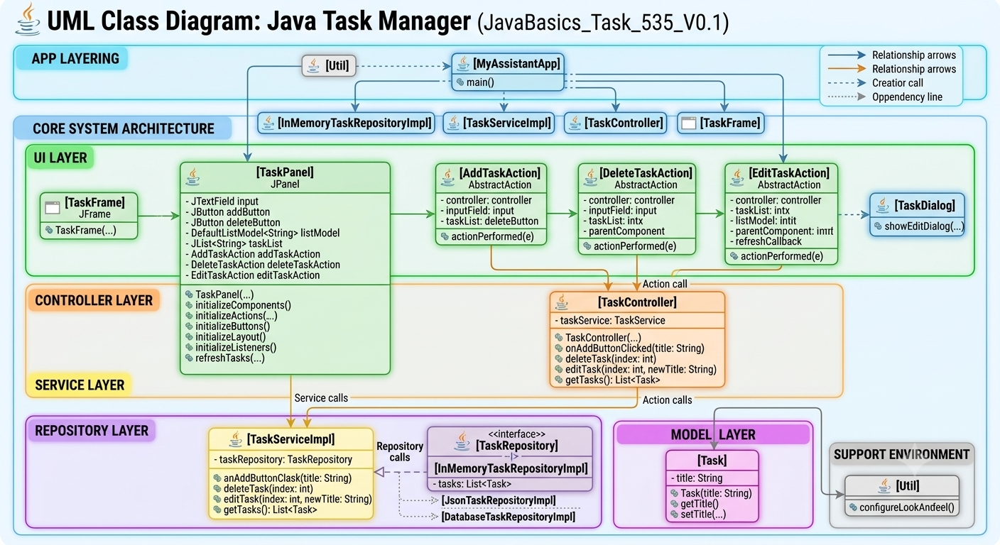

# Multi-Tabbed Workspace Integration and EDT Validation (JavaBasics_Task_536_V0.1)

## 📖 Description
As desktop utilities grow, a single control screen becomes insufficient, requiring layout managers that support seamless screen switching without cluttering the framing layers. This project refactoring **JavaBasics_Task_535_V0.1** to inject a global tabbed navigation container (**`JTabbedPane`**) directly inside the core **`TaskFrame`**. The existing, purely hand-coded **`TaskPanel`** is mounted as the primary operational workspace under the "Tasks" tab lane, while secondary slots are reserved for future features. Additionally, the execution pipeline enforces strict **Event Dispatch Thread (EDT)** synchronization to protect component initialization states across different operating system environments.

## 📋 Requirements Compliance
- **Thread-Safe EDT Pipeline**: Validated the root workspace startup sequence inside a strict `SwingUtilities.invokeLater` callback block.
- **Tabbed Interface Orchestration**: Implemented a global `JTabbedPane` container inside `TaskFrame` to manage workspace separation.
- **Pure Code Component Mounting**: Mounted the existing hand-coded `TaskPanel` directly as a tab child component, avoiding GUI Designer layouts entirely.
- **Maintained Clean Packaging**: Upheld the structural layout boundaries across the standardized `ui.frames`, `ui.panels`, and `app` package scopes.

## 🚀 Architectural Stack
- Java 17+ (Java Swing Component Hierarchy, Multi-Tabbed Navigation Frameworks, AWT Concurrency Control)

## 🏗️ Implementation Details
- **MyAssistantApp**: Central bootstrap execution file managing secure graphical thread launch routines.
- **TaskFrame**: Primary display wrapper organizing global tab switches, viewport bounds, and window state markers.
- **TaskPanel**: Existing hand-coded management panel isolated under the primary workspace navigation tab.

## 📋 Expected result
- Running the entrypoint opens a clean window frame titled "Task Manager" with three tabs: "Tasks", "Tools", and "AI Chat".
- The "Tasks" tab successfully mounts and renders the functional list, field inputs, and control buttons from the previous task.

## 📚 UML Diagram:


## 💻 Code Example

### Project Structure:

    JavaBasics_Task_536/
    ├── src/
    │   └── com/yurii/pavlenko/
    │                 ├── app/
    │                 │   └── MyAssistantApp.java
    │                 │
    │                 ├── ui/
    │                 │   ├── frames/
    │                 │   │   └── TaskFrame.java
    │                 │   ├── panels/
    │                 │   │   └── TaskPanel.java
    │                 │   ├── dialogs/
    │                 │   │   └── TaskDialog.java
    │                 │   └── actions/
    │                 │       ├── AddTaskAction.java
    │                 │       ├── DeleteTaskAction.java
    │                 │       └── EditTaskAction.java
    │                 │
    │                 ├── controller/
    │                 │   └── TaskController.java
    │                 │
    │                 ├── service/
    │                 │   ├── impl/
    │                 │   │   └── TaskServiceImpl.java
    │                 │   └── TaskService.java
    │                 │
    │                 ├── repository/
    │                 │   ├── impl/
    │                 │   │   ├── InMemoryTaskRepositoryImpl.java
    │                 │   │   ├── JsonTaskRepositoryImpl.java
    │                 │   │   └── DatabaseTaskRepositoryImpl.java
    │                 │   └── TaskRepository.java
    │                 │
    │                 ├── model/
    │                 │   └── Task.java
    │                 │
    │                 └── util/
    │                     └── Util.java
    │
    ├── LICENSE
    ├── TASK.md
    ├── THEORY.md
    └── README.md

Code
```java
package com.yurii.pavlenko.app;

import com.yurii.pavlenko.controller.TaskController;
import com.yurii.pavlenko.repository.TaskRepository;
import com.yurii.pavlenko.repository.impl.InMemoryTaskRepositoryImpl;
// import com.yurii.pavlenko.repository.impl.JsonTaskRepositoryImpl;
// import com.yurii.pavlenko.repository.impl.DatabaseTaskRepositoryImpl;
import com.yurii.pavlenko.service.TaskService;
import com.yurii.pavlenko.service.impl.TaskServiceImpl;
import com.yurii.pavlenko.ui.frames.TaskFrame;
import com.yurii.pavlenko.util.Util;

import javax.swing.*;

public class MyAssistantApp {

    public static void main(String[] args) {

        Util.configureLookAndFeel();

        TaskRepository repo = new InMemoryTaskRepositoryImpl();

        // TaskRepository repo = new JsonTaskRepositoryImpl();
        // TaskRepository repo = new DatabaseTaskRepositoryImpl();

        TaskService service = new TaskServiceImpl(repo);
        TaskController controller = new TaskController(service);

        SwingUtilities.invokeLater(() -> new TaskFrame(controller));
    }
}
```

## ⚖️ License
This project is licensed under the **MIT License**.

Copyright (c) 2026 Yurii Pavlenko

Permission is hereby granted, free of charge, to any person obtaining a copy of this software and associated documentation files...

License: [MIT](LICENSE)
